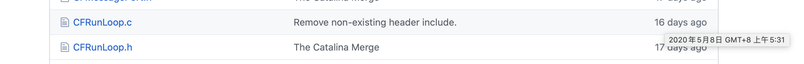

* TOC
{:toc}

# 写在最前

最近开始重温 iOS 开发的基础知识，看到 **ibireme**（后简称"I大"） 写的 [深入理解RunLoop](#https://blog.ibireme.com/2015/05/18/runloop/) 感觉特别详细，但因成文时间与现在跨度太大，本着科学严谨的思想，遂对文章中的部分观点进行了一些验证。

> 注：本文参考的源码在[这里](#https://github.com/apple/swift-corelibs-foundation/) ，`CFRunloop.h/m` 位于 `/CoreFoundation/RunLoop.subproj/` 目录下，最新更新时间为：2020-05-08 05:31 GMT+8
> 
> 

# 概念

在 [苹果官方文档](#https://developer.apple.com/documentation/foundation/runloop) 中我们能够了解到 `Runloop` 是一个对象，它能在应用程序运行的过程中，隐士的处理诸如 消息、事件、计时器等；

* 以下引用自I大的原文：

> RunLoop 实际上就是一个对象，这个对象管理了其需要处理的事件和消息，并提供了一个入口函数来执行上面 Event Loop 的逻辑。线程执行了这个函数后，就会一直处于这个函数内部 “接受消息->等待->处理” 的循环中，直到这个循环结束（比如传入 quit 的消息），函数返回。

另外还需注意的是，RunLoop 并不是线程安全的，在使用 RunLoop 对象时，必须在它所处的线程中。

# RunLoop 与线程的关系

I大 在文章中提到源码中的一个函数： `CFRunLoopRef _CFRunLoopGet(pthread_t thread)`，根据最新版本的源码，已经发生了比较大的改变（也可能是 I大 隐去了一些细节）：

* 函数变为了 `CF_EXPORT CFRunLoopRef _CFRunLoopGet0(_CFThreadRef t)`，函数名、参数类型都发生了改变，但影响不大；
* 用 `__CFLock` 替换了已经不安全的 `OSSpinLock`；(** ibireme** 在[另一篇博客](#https://blog.ibireme.com/2016/01/16/spinlock_is_unsafe_in_ios/)中验证了这个结论）

> 出于好奇，我去 [这个链接](https://opensource.apple.com/tarballs/CF/) 分别下载了 `CF-299`、 `CF-368.28`、`CF-635`、`CF-744.19`、`CF-855.17` 和 `CF-1153.18` 这几个版本的源码，发现除了最后一个版本已经开始使用 `__CFLock` 之外，其余版本用的锁都是 `__CFSpinLock` 而不是文章中写的 `OSSpinLock`，不知道 I大 查阅的是哪个版本的源码 :P

当然这些改动影响不大，主要功能与 I大 表述的并无明显变化；

下面附上目前最新的完整版源码：

```
// should only be called by Foundation
// t==0 is a synonym for "main thread" that always works
CF_EXPORT CFRunLoopRef _CFRunLoopGet0(_CFThreadRef t) {
	if (pthread_equal(t, kNilPthreadT)) {
		t = pthread_main_thread_np();
	}
	__CFLock(&loopsLock);
	if (!__CFRunLoops) {
		CFMutableDictionaryRef dict = CFDictionaryCreateMutable(kCFAllocatorSystemDefault, 0, NULL, &kCFTypeDictionaryValueCallBacks);
		CFRunLoopRef mainLoop = __CFRunLoopCreate(pthread_main_thread_np());
		CFDictionarySetValue(dict, pthreadPointer(pthread_main_thread_np()), mainLoop);
		if (!OSAtomicCompareAndSwapPtrBarrier(NULL, dict, (void * volatile *)&__CFRunLoops)) {
		    CFRelease(dict);
		}
		CFRelease(mainLoop);
	}
	CFRunLoopRef newLoop = NULL;
	CFRunLoopRef loop = (CFRunLoopRef)CFDictionaryGetValue(__CFRunLoops, pthreadPointer(t));
	if (!loop) {
		newLoop = __CFRunLoopCreate(t);
		/// swx notes: #define cf_trace(...) do {} while (0)
		cf_trace(KDEBUG_EVENT_CFRL_LIFETIME|DBG_FUNC_START, newLoop, NULL, NULL, NULL);
		CFDictionarySetValue(__CFRunLoops, pthreadPointer(t), newLoop);
		loop = newLoop;
	}
	__CFUnlock(&loopsLock);
	// don't release run loops inside the loopsLock, because CFRunLoopDeallocate may end up taking it
	if (newLoop) { CFRelease(newLoop); }
    
	if (pthread_equal(t, pthread_self())) {
		_CFSetTSD(__CFTSDKeyRunLoop, (void *)loop, NULL);
		if (0 == _CFGetTSD(__CFTSDKeyRunLoopCntr)) {
#if _POSIX_THREADS
		_CFSetTSD(__CFTSDKeyRunLoopCntr, (void *)(PTHREAD_DESTRUCTOR_ITERATIONS-1), (void (*)(void *))__CFFinalizeRunLoop);
#else
		_CFSetTSD(__CFTSDKeyRunLoopCntr, 0, &__CFFinalizeRunLoop);
#endif
	}
    }
    return loop;
}
```

一些简单的说明：

* 首次调用这个函数时，因为 `__CFRunLoops` 为 `NULL`，会创建一个字典 `dict` 和 `mainLoop`，并将 `pthreadPointer(pthread_main_thread_np())` 作为 `key`，`mainLoop` 作为值保存在 `dict` 里；此时通过 `OSAtomicCompareAndSwapPtrBarrier` 函数，在 `__CFRunLoops` 等于 `NULL` 时，将 `dict` 赋值给 `__CFRunLoops`，并保证其原子性，否则不赋值；
* 根据传递进来的线程 `t` 获取 `runLoop` 对象，如果对象不存在就创建一个新的；

> 这里有一个`cf_trace` 函数，在文件头部被声明为 `#define cf_trace(...) do{}while(0)`，这在 `C/C++` 中比较常见，一般用来消除 `goto` 语句；
> 
> 在宏定义中声明，还能够让宏定义作为 if 语句条件的情况下保证不出错；
> 
> 网上搜了搜并没有发现 `tc_trace` 的有关说明，因此这个函数在这里的具体作用尚不清楚，如有知晓的老哥老姐欢迎补充；

* 下一步，判断传递进来的线程 `t` 是否是当前线程，如果是，就调用 `CFSetTSD` 设置 `__CFRunLoops` 和 `loop` 的对应关系；`TSD` 即 `thread specific data`，意思是线程特有数据；
* 最后一步，通过 `__CFFinalizeRunLoop` 这个函数将其释放；至于为什么通过 `CFTSDKeyRunLoopCntr` 能够设置清理 `loop` 的回调，另一位先行者 **ZenonHuang** 在他的 [blog](https://juejin.im/post/5aaa15d36fb9a028d82b7d83#heading-13) 里做了详细说明；

> 顺带说一句，通过 `CFPlatform.c` 中 `__CFTSDFinalize` 的实现，以及 `CFInternal.h` 中的宏定义：
> 
> {
> 
>  ...
> 
>  __CFTSDKeyRunLoop = 10,
> 
> ...
> 
> // autorelease pool stuff must be higher than run loop constants
> __CFTSDKeyAutoreleaseData2 = 61,
> 
> __CFTSDKeyAutoreleaseData1 = 62,
> 
> ...
> 
> }
> 
> 可以明确推断出 `RunLoop` 和 `aotuRelease` 的释放顺序关系：前者在后者释放之前释放；


* 还有一点需要说明的是，苹果不允许用户直接创建 `RunLoop`，而是提供了两个函数 `CFRunLoopGetMain` 和 `CFRunLoopGetCurrent` 来实现，它们在内部都调用了 `_CFRunLoopGet0`；


# 参考链接

* [深入理解RunLoop](https://blog.ibireme.com/2015/05/18/runloop/)
* [RunLoop源码阅读](https://juejin.im/post/5aaa15d36fb9a028d82b7d83)
* [do...while(0)的妙用](https://www.cnblogs.com/flying_bat/archive/2008/01/18/1044693.html)
* [Unix线程私有数据](http://zdyi.com/books/apue/s11/11.9.html)
