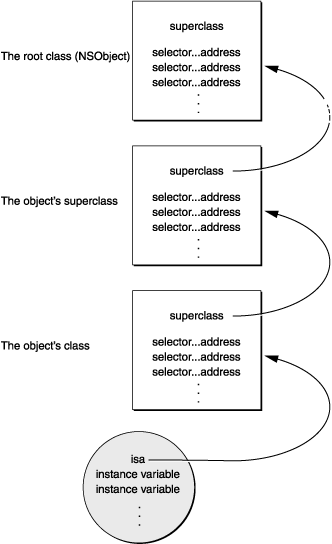

* TOC
{:toc}

本文主要探究函数和方法的原理和机制

## 简介

Objective-C 语言会将编译和链接等操作尽可能的推迟到运行时，这意味着只有编译器是不够的，还需要 Runtime 作为操作系统来执行编译后的代码，这种情况下 Runtime 就充当了 Objective-C 的一种操作系统，来保证其正常运行。

## Runtime 版本

Runtime 有两个版本：`modern` 和 `legacy`：

* `modern`: 在 Objective-C 2.0 中被引入，它被运行在 iPhone app 和 OS X v10.5 以及之后的 64 位程序中；
* `legancy`: 运行在较早的 Mac OS 的 32 位程序之中；

它们的区别在于，在`legancy` 版本的 runtime 中修改一个类的实例变量的布局时，还需要重新编译它的子类；而 `modern` 不需要；

## 与 Runtime 交互

Objective-C 与 Runtime 在三个不同的层级进行交互：通过 Objective-C 源码；通过 `Fundation` 框架中 `NSObject` 定义的方法；直接调用 Runtime 函数；

### Objective-C 源代码

大部分情况下，你只需写好 Objective-C 代码就行，Runtime 会自动在幕后执行它的工作；

当你编译一段 Objective-C 代码时，编译器会创建为实现动态语言特性而创建的数据结构和函数。它的原理实际上是通过 Objective-C 源代码调用发送消息的功能，这里面的具体内容，会在[消息](#)中讲到。

### NSObject 方法

大部分类都是继承自 `NSObject`，这样使得它们都继承了 `NSObject` 中定义的方法（例外的情况是 `NSProxy`，更多信息可以参见[这里](#)）；因此，它的方法建立了每个实例和对象的固有行为。然而在少数情况下，`NSObject` 类仅仅定义了如何操作的样板，但是没有提供所有必要的代码；

举个例子：`NSObject` 定义了 `description` 这个实例方法，这个方法会返回一个用于描述这个类的字符串，它并不知道实际使用时应该如何返回，因此我们需要将这个方法重载，以返回符合具体业务的结果。

`NSObject` 还有一些方法能在运行时获取类的信息，并检查一些特性：比如`class` 返回对象的类；`isKindOfClass:` 和 `isMemberOfClass:` 检查对象是否在指定的类继承体系中；`respondsToSelector:` 检查对象能否可以接受特定消息；`conformsToProtocol:` 检查对象是否实现了指定协议中定义的方法；`methodForSelector:` 则返回指定方法实现的地址。

### Runtime 函数

`Runtime` 系统是一个由一组函数和数据结构组成、具有公共接口的动态共享库。它的头文件位于 `/usr/include/objc` 目录下。许多函数允许你用纯 C 代码来重复实现 Objective-C 中同样的功能。虽然有一些方法构成了 `NSObject` 类的基础，但是你在写 Objective-C 代码时一般不会直接用到这些函数的，除非是写一些 Objective-C 与其他语言的桥接或是底层的 debug 工作。在 [Objective-C Runtime Reference](https://developer.apple.com/documentation/objectivec/objective_c_runtime) 中有对 Runtime 函数的详细文档。

## 消息传递

### objc_msgSend 函数

在 Objetcive-C 中，函数调用的写法是将对象和函数包裹在中括号中，就像：

```objc
[receiver message]
```

编译器会把它转为成一个消息函数：`objc_msgSend`，它的带参数和不带参数的调用方式分别为以下两种：

```objc
objc_msgSend(receiver, selector)
```

```objc
objc_msgSend(receiver, selector, arg1, arg2, ...)
```

消息传递为动态绑定做了一下事项：

* 首先查找 selector 引用的方法实现；
* 然后调用这个方法，同时将对象、和参数传递过去；
* 最后将这个方法的返回值作为自己的返回值返回；

> 需要注意的是，这个过程是由编译器自动处理的；我们的代码无法直接执行这个过程；

消息传递的关键在于编译器为每个类和对象构建的结构，每个类都会包含一下两个基本元素：

* 指向超类（super class）的指针；
* 一个类的调度表（dispatch table）；它可以将 selector 和 具体的方法实现联系起来；

创建新对象时，将为其分配内存，并初始化其实例变量。 对象变量中的第一个是指向其类结构的指针。 这个称为isa的指针使对象可以访问其类，并通过该类访问其继承的所有类。

当一个对象被创建、分配内存时，它的实例里的变量会初始化，里面有一个指向它的类的结构体的指针，被称作 `isa` 指针，这个指针使对象可以访问它的类以及它的所有超类（父类）；

这些类和对象的结构图类似下图：



当一条消息被发送给一个对象时，消息传递函数会跟随 isa 指针指向类结构，并且根据调度表查询方法选择器（method selector）；如果无法找到，则 objc_msgSend 将会不断指向其超类，并尝试在超类的调度表中查询方法选择器（method selector），直到查询到 NSObject 类。当找到选择器后，便调用其对应的方法，传递参数。

这就是在 runtime 中实现方法的方式——用面向对象编程（object-oriented programming）的术语表述就是将方法动态绑定到消息。

为了加快消息传递过程，运行时系统会在使用方法的选择器和地址时对其进行缓存。每个类都有单独的缓存，包含它继承的以及自身定义的 selector；实际工作过程中，会先在缓存中查询 selector，没有的话再去调度表中查询；而且如果缓存中存在被查询的 selector，它的调用速度仅仅比直接调用 runtime 函数稍慢一些；缓存在程序运行时动态增长以容纳新消息。

### 消息传递过程中的隐藏参数

当 objc_msgSend 函数查询到实现方法的程序时，它将调用这个程序并将消息中的参数传递过去。同时也会传递两个隐藏参数：

* 接收消息的对象
* 方法的选择器（selector for the method）

这两个参数为每个方法的实现提供调用时的相关信息，之所以称之为“隐藏”是因为没有声明这两个参数，而是在编译时直接插入到方法的实现中。

尽管这两个参数么有被声明，Objective-C 源码依旧能够引用它们（就像它能够引用接收对象的变量一样）。在方法内将接收对象称作 `self`，自己的选择器称作 `_cmd`，下面是一个这样的例子：

```objc
- (returnType)strange
{
    id  target = getTheReceiver();
    SEL method = getTheMethod();
 
    if ( target == self || method == _cmd )
        return nil;
    return [target performSelector:method];
}
```

`self` 指的是接收 `strange` 方法的对象，`_cmd` 指的是 `strange` 方法的 selector；

在这两个参数中，`self` 更有用。实际上，它是在方法实现中访问消息接收者对象的实例变量的途径。

### 获取方法的地址

规避动态绑定的唯一方法是获取方法的地址，然后直接调用它，就好像它是一个函数一样。这种做法很少用，除非是需要持续大量重复调用某方法的极端情况，避开消息发送泛滥而直接调用该方法会更高效。

在 `NSObject` 类中定义了一个 `methodForSelector:` 方法，你可以用它来获取某个方法选择器对应的 `IMP`（指针），例如：

```objc
void (*setter)(id, SEL, BOOL);
int i;
 
setter = (void (*)(id, SEL, BOOL))[target
    methodForSelector:@selector(setFilled:)];
for ( i = 0 ; i < 1000 ; i++ )
    setter(targetList[i], @selector(setFilled:), YES);
```

调用上面这个过程的前两个参数分别是接收对象（self）和方法的选择器（_cmd）；这两个参数在方法语句中被隐藏了，但是当方法作为函数被调用时必须明确存在。

使用 `methodForSelector:` 方法绕过动态绑定的做法能够可以节省很大一部分消息发送的时间。但是只有在一个特定的消息重复许多次时，方法才会被签名认证，如上面例子中的for循环。

> `methodForSelector:` 方法是在 Runtime 中提供的，而不是 

## 动态方法解析

### 动态方法解析

这部分描述了如何动态提供方法的实现；

有的时候我们可能需要动态的提供一个方法的实现，例如我们可以用 `@dynamic` 关键字修饰一个属性：

```
@dynamic propertyName;
```

这将告诉编译器我们会为这个属性动态提供存储方法；

我们可以重载 `resolveInstanceMethod:` 和 `resolveClassMethod:` 这两个方法分别添加实例方法实现和类方法实现。

一个 Objective-C 方法是一个至少带有两个参数 `self` 和 `_cmd` 的 C 函数。我们可以使用 `class_addMethod` 将一个函数作为一个类的实例方法：

```objc
void dynamicMethodIMP(id self, SEL _cmd) {
    // implementation ....
}
```

我们也可以使用 `resolveInstanceMethod:` 来为一个类动态添加类方法：

```objc
@implementation MyClass
+ (BOOL)resolveInstanceMethod:(SEL)aSEL {
    if (aSEL == @selector(resolveThisMethodDynamically)) {
          class_addMethod([self class], aSEL, (IMP) dynamicMethodIMP, "v@:");
          return YES;
    }
    return [super resolveInstanceMethod:aSEL];
}
@end
```

转发方法和动态方法解析是紧密相关的，一个类在消息转发机制启动之前会动态地解析方法。调用 `respondsToSelector:` 或 `instancesRespondToSelector:` 时会先为 selector 提供 IMP，从而可以进行动态方法处理；如果你想让该 selector 被传送到转发机制，那么就调用 `resolveInstanceMethod:` 同时让它返回 NO。

### 动态加载

Objective-C 程序可以在运行时加载或链接新的类（class）和类别（categories），新加入的代码会合并进程序中，与一开始加载的类或类别同等对待。

动态加载可以用于很多不同的场景，例如，系统偏好设置中的各个模块正是使用了动态加载。

在 Cocoa 环境中，动态加载常用于应用的自定义。我们可以编写在运行时加载的模块，就像Interface Builder加载自定义选项板和OS X System Preferences应用程序加载自定义首选项模块一样。

## 消息转发

向一个不处理某条消息的对象发送这条消息是错误的，如果这么做会产生一个异常，但是在这个异常生效之前，runtime 系统能够让这个对象有另一个机会来处理异常。

### 转发

如果向一个无法处理某个消息的对象发送消息，在错误发生前 runtime 会给这个对象发送一条`forwardInvocation:` 消息，这条消息中带有一个 `NSInvocation` 对象作为唯一参数，这个 `NSInvocation` 对象封装了原始消息以及随其传递的参数。

我们可以为消息实现一个 `forwardInvocation:` 方法，用来返回一个默认的响应，或者用另外的方式避免报错。顾名思义，`forwardInvocation:` 通常用于将消息转发到另一个对象。

现在可以设想一个场景，假如我们想设计一个能响应 `negotiate` 方法的对象 a，而 `negotiate` 方法的实现是在其他对象 b 中。我们可以通过发送 `negotiate` 消息到实现这个方法的类b中去，简单地完成这个功能。

更进一步，假设我们想要这个对象 a 能精确地(exactly)执行 `negotiate` 方法，一个方法是继承。但是它不可能在两个类的对象中传值。

我们可以通过实现一个方法简单地传送消息到类 b 的实例中去“借” `negotiate` 方法，就像这样：

```objc
- (id)negotiate {
    if ( [someOtherObject respondsTo:@selector(negotiate)] )
        return [someOtherObject negotiate];
    return self;
}
```

这种处理方式可能会带来一些麻烦，尤其是当我们希望将对象传递给另一个对象的消息数量很多时，此时我们就必须实现多个方法，才能涵盖我们向从另一个类中“借用”的每个方法。于此同时，如果在实际的编码过程中存在一些未知的消息，我们也无法对其作出有效的处理。更何况随着具体业务的发展，这些类在未来的某个时刻改变的几率也非常大，这样一来未知的变数就更大了。

而 `forwardInvocation:` 就能很好的解决这个问题。它的工作机制是：当一个对象由于没有与消息中的 selector 匹配的方法而无法响应消息时，runtime 系统会通过向它发送 `forwardInvocation:` 消息来告知该对象。因为绝大多数继承自 `NSObject` 的类都继承了 `forwardInvocation:` 方法，但是在 `NSObject` 中，该方法仅仅调用了 `doesNotRecognizeSelector:`，无法处理绝大多数实际的情况，此时我们需要在子类中重载 `forwardInvocation:` 方法，将消息转发到其他对象中。

为了能够转发消息，所有的 `forwardInvocation:` 方法都需要做这几件事：

* 确定消息将会被转发到哪；
* 转发消息的同时需要把原始参数一并传递；

消息将在 `invokeWithTarget:` 方法中被发送：

```objc
- (void)forwardInvocation:(NSInvocation *)anInvocation {
    if ([someOtherObject respondsToSelector:
            [anInvocation selector]])
        [anInvocation invokeWithTarget:someOtherObject];
    else
        [super forwardInvocation:anInvocation];
}
```

消息的返回值是返回给原始发送者的，所有类型的返回值都能够返回给发送方，包括 `id`、结构体（structures）以及 `Double`、`Float` 等。

`forwardInvocation:` 方法能够扮演一个未知消息的构建中心，将它们打包到其他接收者；它也能作为一个中转站，将所有消息转发到同一目的地；它能够将一条消息转译为另一条消息，或者简单的将无法响应的消息或错误消息 “吞掉”；它能将多条消息合并为一个响应... `forwardInvocation:` 方法主要面向方法实现，但是它提供的通过消息转发链链接对象的机会为程序设计带来更多可能性。

> 只有在调用了不存在的方法导致消息无法处理时才会调用 `forwardInvocation:` 方法；

## 转发和多继承

转发和继承相似，可以用于为Objc编程添加一些多继承的效果。就像下图那样，一个对象把消息转发出去，就好似它把另一个对象中的方法借过来或是“继承”过来一样。


在这张图中，Warrior 类的一个对象转发了一条 `negotiate` 消息到 Diplomat 类的一个对象，此时的 Warrior 对象就像 Diplomat 对象一样，它将会对 `negotiate` 消息作出回应（尽管实际上是由 Diplomat 对象在处理）。

这使得不同继承体系分支下的两个类可以“继承”对方的方法，在上图中 Warrior 和 Diplomat 没有继承关系，但是 Warrior 将 negotiate 消息转发给了 Diplomat 后，就好似 Diplomat 是 Warrior 的超类一样。

消息转发提供了许多类似于多继承的特性，但是他们之间有一个很大的不同：

* 多继承：合并了不同的行为特征在一个单独的对象中，会得到一个重量级多层面的对象。
* 消息转发：将各个功能分散到不同的对象中，得到的一些轻量级的对象，这些对象通过消息通过消息转发联合起来。

## 替代对象


## 方法调用

在 Objctive-C 中，方法的调用是在 Runtime 中通过发送消息的方式进行的，同时我们可以在 Runtime 中动态的添加变量、方法、类等，所以我们可以认为 Objective-C 是一门动态的语言。方法调用也是动态的。

## 参考文献/链接

* [Objective-C Runtime Grograming Guide](https://developer.apple.com/library/archive/documentation/Cocoa/Conceptual/ObjCRuntimeGuide/Introduction/Introduction.html?language=objc#//apple_ref/doc/uid/TP40008048)
* [Objective-C Runtime（玉令天下的博客）](http://yulingtianxia.com/blog/2014/11/05/objective-c-runtime/)
* [关于Objective-C Runtime看我就够了](https://www.jianshu.com/p/f73ea068efd2)
* [Objective-C Runtime](https://hit-alibaba.github.io/interview/iOS/ObjC-Basic/Runtime.html)

https://yangjie2.github.io/2018/10/15/深入理解Objective-C：方法调用/
https://www.jianshu.com/p/114782a909f9
https://www.jianshu.com/p/540f3f6b6f66
https://www.jianshu.com/p/f73ea068efd2